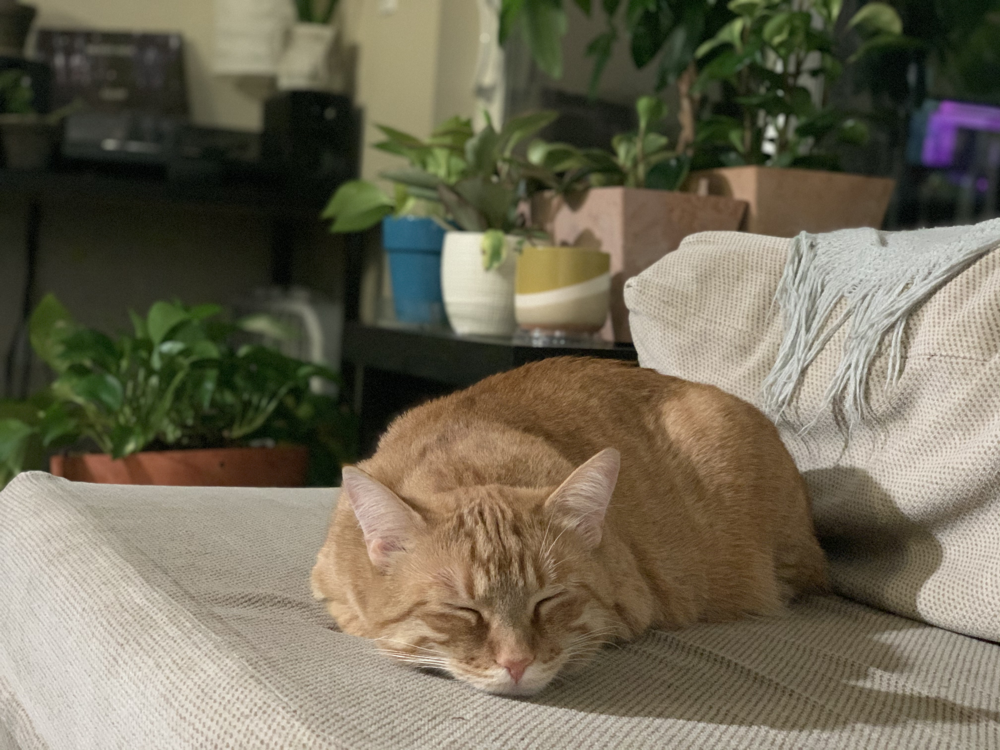

In this paper I outline the methods in the field experiment Sleeping in Different Places around the Apartment (SiDPA), in which I sleep in different places around the apartment. Below are some images from the field.

Recommended citation: Flame Murphy. (2019). "Sleeping in Different Places around the Apartment (SiDPA): A field experiment" <i>Journal of Feline Research</i>. 1(3).
